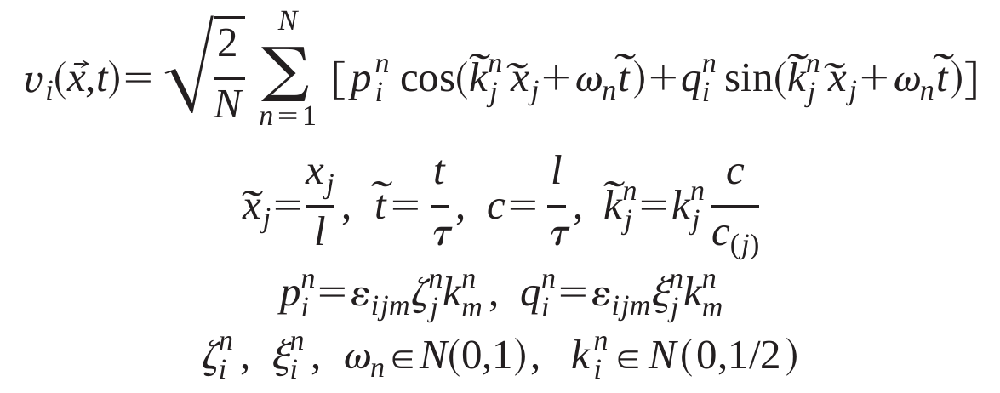
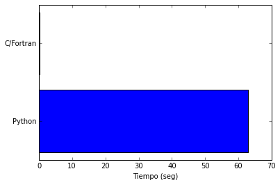
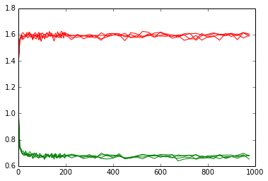
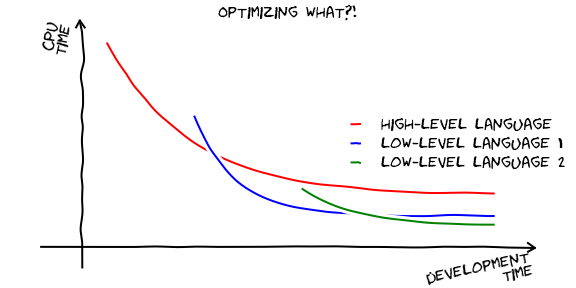
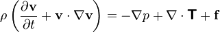

:title: Desarrollando mecánica de fluidos con Python
:author: Agstin Ferrario
:description: Esta el al presentación de Desarrollando Mecánica de Fluidos con Python hecha para la SciPyCon Argentina 2014. Espero que sea de su agrado.
:kewords: CFD, RFG, scipycon, python
:css: presentacion.css

.. Gracias a mgaitan por el css

Desarrollando mecánica de fluidos con Python
============================================

Agustin Ferrario
----------------

@py_crash
---------

----

Un poco más de mí
=================

* Soy estudiante de Ingeniería Química
* A partir de este año comencé a usar Python *en serio*
* Trabajo como becario en el Grupo de Investigación en Mecánica de Fluidos (GIMEF) en la UTN FRRe

* Actualmente trabajo utilizando un algoritmo conocido como **Random Flow Generation (RFG)**

.. note:: 
    * Anteriormente más de unas horas en codecademy no había hecho
    * No soy un especialista en python
    * Ni tampoco un especialista en fluidos

----

¿Que es el *RFG*?
=================

* Algoritmo creado por Andrei Smirnov y otros en 2001

----

¿Que es el *RFG*?
=================

* Basicamente ingresamos:
    -  Las condiciones de la turbulencia
    -  Un vector de posición 
    -  Y un instante de tiempo 

* Nos devuelvo un vector de velocidad 
* Se utiliza como condición de desborde
  
.. note:: 
  * Distintos problemas de mecánica de fluidos
  * Existen aplicaciones para dinámica de partículas
  * Burbujas --> aplicaciones navales
  * Y por supuesto LES

.. Revisar si poner una imagen acá. LLego a hacerla?
  
----

¿Por qué realizarlo con python?
===============================

* Porque es fácil, y se puede modifcar rápidamente
* Porque es amigable para un "no programador"
* Porque era lo que sabía
  
.. note:: 
  Esto nos permitiría por ejemplo modifcarlo y compararlo con otros métodos
  o mejorar el método ya existente.

----

Ahora bien ¿Python es fácil?
============================

Sí, pero igual podemos cometer errores:

* Errores de tipado dinámico:

.. code:: python

    sqrt(1/n) != sqrt(1./n)  # n = {1, 2, 3, 4, ...}

* Código ilegible:

.. code:: python

    sum1 += (zeta[n,1]*k[n,2]-zeta[n,2]*k[n,1])*\
	    cos(K[n,0]*X[n,0]+K[n,1]*X[n,1]+K[n,2]*X[n,2]+w[n]*t[i])\
        + (xi[n,1]*k[n,2]-xi[n,2]*k[n,1])*\
	    sin(K[n,0]*X[n,0]+K[n,1]*X[n,1]+K[n,2]*X[n,2]+w[n]*t[i])

----

Pero todo tiene solucion
========================
* Errores de tipado dinámico:
    - Leyendo
* Código sea ilegible:
    - Flake8
    - Usando una IDE: Spyder

----

Pero python es lento
====================
Corramos una prueba:
Mi version en python contra el código original en C/Fortran:

* 1 punto, 10 pasos de tiempo

.. code:: python

    def print_one_point():
    Nt = 1000; r = array([[1, 0, 0],[0, 1, 0], [0, 0, 1]], dtype=float)
    tau = 1.; L = 1.; x = array([0, 0, 0], dtype=float)
    
    t_array = arange(0, 10, 1.)
    
    for t in t_array:
        v_result = v(x, r, L, tau, t, Nt)
        result = hstack([t, v_result])
        print result

* Una malla de 10 por 10 puntos, 10 pasos de tiempo

----

Resultados
==========

1 punto, 10 pasos de tiempo
---------------------------

.. note:: 
    A python le toma 565 ms
    A fortran 5 ms

----

Resultados
==========

10 por 10 puntos, 10 pasos de tiempo
------------------------------------

.. note:: 
    A python le toma 63 s
    A fortran 259 ms
    
----

Seamos justos con python
========================
* El código lo desarrollé yo
* No está optimizado en ningún sentido
* La implentación está hecha tan simplente con un for y las siguientes librerías

.. code:: python

    from numpy import array, dot, cross, cos, sin, sqrt
    from numpy.random import normal
    from numpy.linalg import eigvals

-----

Python es tan lento como lo hagamos
===================================

.. code:: python

    def convergence_test_v():
        n_array = hstack((arange(1, 200, 5),arange(200, 1000, 25)))
        means_array = array([])
        std_array = array([])

        for Nt in n_array:
            module_array = array([])
            for i in range(2000):
                z = rfg(x, r, L, tau, t, Nt)
                module_array = hstack((module_array, norm(z)))
                means_array = hstack([means_array, mean(module_array)])
                std_array = hstack([std_array, std(module_array)])
                
        plot(n_array, means_array, 'red')
        plot(n_array, std_array, 'green')

----

Python es tan lento como lo hagamos
===================================
Llamamos a la funcion RFG unas 144.000 veces

Y tarda **38 minutos** en correr

Sin embargo, nos llevó **20 minutos** escribirla

----

Entonces ¿Python es lento?
==========================

----

¿Es posible usar python para CDF?
=================================

Tenemos que resolver:

Lorena A. Barba tiene un "curso" `sobre esto`_

.. _`sobre esto`: http://lorenabarba.com/blog/cfd-python-12-steps-to-navier-stokes/

----

¿Es posible usar python para CDF?
=================================

Tenemos que resolver:

Lorena A. Barba tiene un "curso" `sobre esto`_

Numpy y matplotlib FTW!
-----------------------

.. _`sobre esto`: http://lorenabarba.com/blog/cfd-python-12-steps-to-navier-stokes/

----

Entonces
========

¡Sí se puede!
-------------

----

No sé ustedes, pero yo no tengo ganas de aprender C o Fortran..Así que seguiré con python:

.. image:: img/python-logo-master-v3-TM.png
    :width: 300px
    :height: 100px

----

Gracias
=======

(o perdón)
----------

@py_crash
.........
